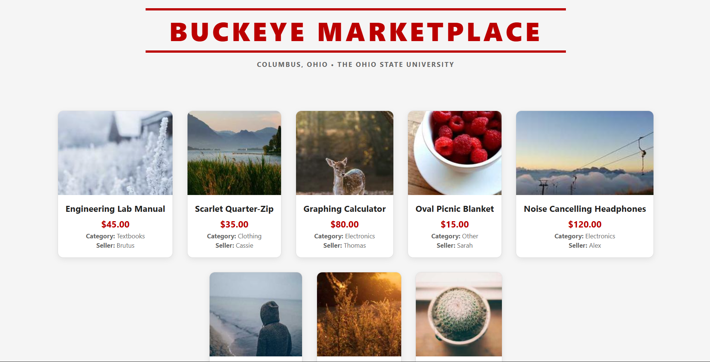
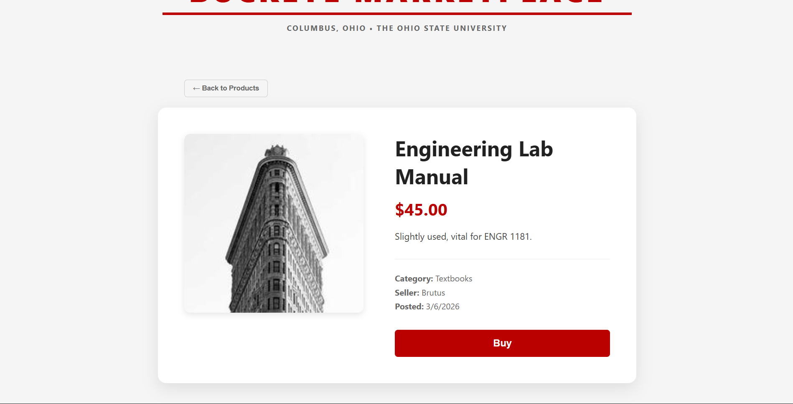

# 🛍️ Buckeye Marketplace
**Course:** AMIS 4630 - Spring 2026  
**Developer:** Justin Burkett  

---

## 📝 Project Description
Buckeye Marketplace is a full-stack web application designed for the OSU community. It features a **React** frontend styled with a **Scarlet and Gray** color scheme and a **.NET API** backend that manages product data. The app allows users to browse a product catalog and view specific item details with a cohesive, university-branded UI.

---

## 🚀 How to Run Locally

### 1. Backend (.NET API)
1. Navigate to the backend folder: `cd backend`
2. Run the server: `dotnet run`
   *The API is configured to run at `http://localhost:5000`.*

### 2. Frontend (React)
1. Navigate to the frontend folder: `cd frontend`
2. Install dependencies: `npm install`
3. Start the app: `npm run dev`
   *The application will be available at `http://localhost:5173`.*

---

## 📸 Screenshots

### Product List Page

*Displays the gallery of available items with Buckeye-themed headers and accents.*

### Product Detail Page

*Displays specific product descriptions, pricing, and images.*

---

## 🤖 AI Usage Summary

**Prompts Used:**
* "How to move folders between repos using PowerShell while maintaining project structure."
* "React CSS styles for Ohio State Scarlet and Gray."
* "Markdown syntax for images in subfolders."
* "Helped scaffold the ProductsController for a .NET API."
* "Generated sample product data for a marketplace catalog."

**What I Accepted:**
* The terminal commands for migrating the API and Frontend folders and managing repository remotes.
* The boilerplate code for the `ProductsController` and the mock JSON data for the initial product list.
* The basic CSS layout for the product grid and navigation bar.

**What I Changed:**
* **Manually adjusted the formatting of the basic product list and product detail page structure provided by the AI to better fit the project's layout.**
* Manually configured the ports to ensure the React app (5173) and .NET API (5000) connected properly.
* Customized the scaffolded Controller logic to match my specific database model and requirements.
